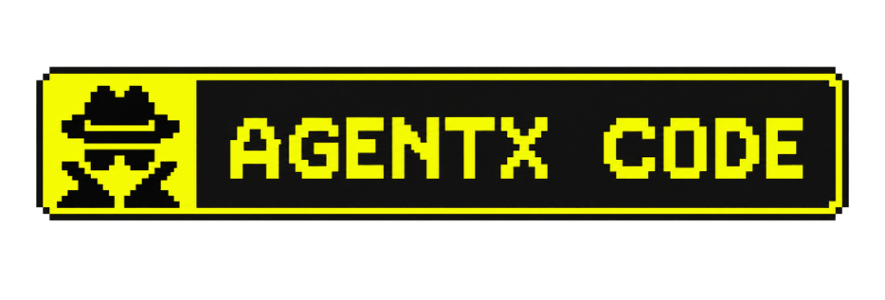

<p align="center">
  <a href="https://github.com/SohailKhan0525/agentx-cli">
    <p align="center">
  
</p>
  </a>
</p>
<p align="center">Den open source AI-kodeagent.</p>
<p align="center">
  <a href="https://www.npmjs.com/package/@agent-qofeno/agentx-cli"></a>
  <a href="https://github.com/SohailKhan0525/agentx-cli/actions/workflows/publish.yml"></a>
</p>

<p align="center">
  <a href="README.md">English</a> |
  <a href="README.zh.md">简体中文</a> |
  <a href="README.zht.md">繁體中文</a> |
  <a href="README.ko.md">한국어</a> |
  <a href="README.de.md">Deutsch</a> |
  <a href="README.es.md">Español</a> |
  <a href="README.fr.md">Français</a> |
  <a href="README.it.md">Italiano</a> |
  <a href="README.da.md">Dansk</a> |
  <a href="README.ja.md">日本語</a> |
  <a href="README.pl.md">Polski</a> |
  <a href="README.ru.md">Русский</a> |
  <a href="README.bs.md">Bosanski</a> |
  <a href="README.ar.md">العربية</a> |
  <a href="README.no.md">Norsk</a> |
  <a href="README.br.md">Português (Brasil)</a> |
  <a href="README.th.md">ไทย</a> |
  <a href="README.tr.md">Türkçe</a> |
  <a href="README.uk.md">Українська</a> |
  <a href="README.bn.md">বাংলা</a> |
  <a href="README.gr.md">Ελληνικά</a> |
  <a href="README.vi.md">Tiếng Việt</a>
</p>

[](https://github.com/SohailKhan0525/agentx-cli)

---

### Installation

```bash
# YOLO
curl -fsSL https://raw.githubusercontent.com/SohailKhan0525/agentx-cli/main/install | bash

# Pakkehåndteringer
npm i -g agentx-ai@latest        # eller bun/pnpm/yarn
scoop install agentx             # Windows
choco install agentx             # Windows
brew install SohailKhan0525/tap/agentx # macOS og Linux (anbefalet, altid up to date)
brew install agentx              # macOS og Linux (officiel brew formula, opdateres sjældnere)
sudo pacman -S agentx            # Arch Linux (Stable)
paru -S agentx-bin               # Arch Linux (Latest from AUR)
mise use -g agentx               # alle OS
nix run nixpkgs#agentx           # eller github:SohailKhan0525/agentx-cli for nyeste dev-branch
```

> [!TIP]
> Fjern versioner ældre end 0.1.x før installation.

### Desktop-app (BETA)

AgentX Code findes også som desktop-app. Download direkte fra [releases-siden](https://github.com/SohailKhan0525/agentx-cli/releases) eller [github.com/SohailKhan0525/agentx-cli/download](https://github.com/SohailKhan0525/agentx-cli/download).

| Platform              | Download                           |
| --------------------- | ---------------------------------- |
| macOS (Apple Silicon) | `agentx-desktop-mac-arm64.dmg`   |
| macOS (Intel)         | `agentx-desktop-mac-x64.dmg`     |
| Windows               | `agentx-desktop-windows-x64.exe` |
| Linux                 | `.deb`, `.rpm`, eller AppImage     |

```bash
# macOS (Homebrew)
brew install --cask agentx-desktop
# Windows (Scoop)
scoop bucket add extras; scoop install extras/agentx-desktop
```

#### Installationsmappe

Installationsscriptet bruger følgende prioriteringsrækkefølge for installationsstien:

1. `$OPENCODE_INSTALL_DIR` - Tilpasset installationsmappe
2. `$XDG_BIN_DIR` - Sti der følger XDG Base Directory Specification
3. `$HOME/bin` - Standard bruger-bin-mappe (hvis den findes eller kan oprettes)
4. `$HOME/.agentx/bin` - Standard fallback

```bash
# Eksempler
OPENCODE_INSTALL_DIR=/usr/local/bin curl -fsSL https://raw.githubusercontent.com/SohailKhan0525/agentx-cli/main/install | bash
XDG_BIN_DIR=$HOME/.local/bin curl -fsSL https://raw.githubusercontent.com/SohailKhan0525/agentx-cli/main/install | bash
```

### Agents

AgentX Code har to indbyggede agents, som du kan skifte mellem med `Tab`-tasten.

- **build** - Standard, agent med fuld adgang til udviklingsarbejde
- **plan** - Skrivebeskyttet agent til analyse og kodeudforskning
  - Afviser filredigering som standard
  - Spørger om tilladelse før bash-kommandoer
  - Ideel til at udforske ukendte kodebaser eller planlægge ændringer

Derudover findes der en **general**-subagent til komplekse søgninger og flertrinsopgaver.
Den bruges internt og kan kaldes via `@general` i beskeder.

Læs mere om [agents](https://github.com/SohailKhan0525/agentx-cli/docs/agents).

### Dokumentation

For mere info om konfiguration af AgentX Code, [**se vores docs**](https://github.com/SohailKhan0525/agentx-cli/docs).

### Bidrag

Hvis du vil bidrage til AgentX Code, så læs vores [contributing docs](./CONTRIBUTING.md) før du sender en pull request.

### Bygget på AgentX Code

Hvis du arbejder på et projekt der er relateret til AgentX Code og bruger "agentx" som en del af navnet; f.eks. "agentx-dashboard" eller "agentx-mobile", så tilføj en note i din README, der tydeliggør at projektet ikke er bygget af AgentX Code-teamet og ikke er tilknyttet os på nogen måde.

---

**Bliv en del af vores community** [Discord](https://discord.gg/agentx) | [X.com](https://x.com/agentx)
